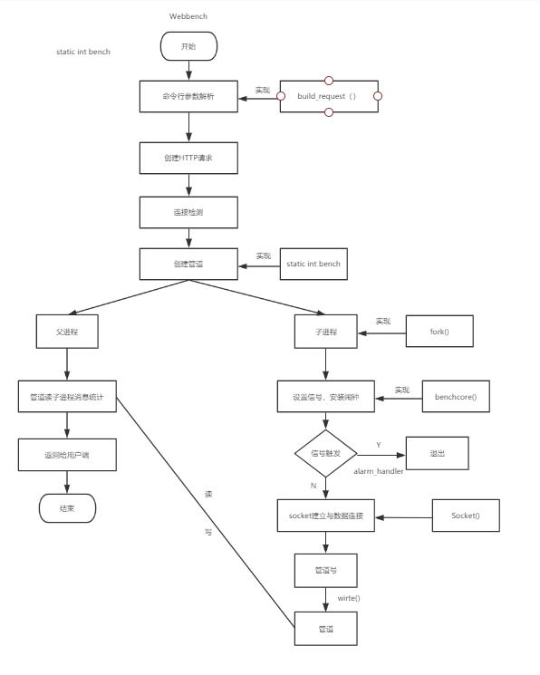

# Webbench

* 简单的网站压力测试工具
* 通过创建子进程模拟客户端，在一定时间内向目标网站重复发送请求，并

计算返回的数据

### 使用

两个文件一起编译

` gcc socket.c  webbench.c `

使用

`./a.out -c 100 -t 60  http://www.baidu.com/`

### 总结（参考）

1，用户从命令行输入命令，以及服务器的主机地址，端口号，如果输入错误则usage提示
2，通过gelong_opt库函数对用户输入的argv数组的参数按照格式用optind和optarg进行排序和处理，形成一个符合的顺序，方便对命令行参数进行处理
3，当输入p（即proxy代理）时，利用strrchr函数，用proxyhost获取用户输入的ip地址和端口的字符串，用proxyport获取端口的整型数字（atoi函数实现字符串到整型的转换）
/**参数被整理后的不认识的参数(网址)会放到最后，而gelong_opt只处理它认识的选项，处理完选项后再执行getopt_long将会返回EOF，optarg会继续后移（实际上是optarg先后移，再判断该参数是否认识），在这里就是指向网址了**/
4，当循环结束后argv[optind]会指向服务器的网址,并通过这个网址构造请求信息体
（1）build_request函数中构造request信息体（请求命令  + 服务器ip地址（主机号host和端口号port）+ 协议版本号），通过strcpy,strcat string字符串的处理函数实现
（2）用strstr判断用户输入参数中是否有地址符号确定参数的准确性，以及其他各种对参数的判断操作，根据是否是使用代理服务器去判断如何构造请求信息体，如果没有使用代理服务器，再对reque函数参数url进行检验(strncasecmp函数实现)
（3）各种检验后，如果函数参数url合理，再根据是否使用代理服务器，进行不同的操作去获取主机号host(host字符串是放到socket那个函数去使用的)和端口号proxyport，，以及往请求信息体中追加服务器ip地址
/**填IP地址的时候是先判断一下proxyhost是否为空而不是先检验，当然在此前检验了://后面是否为空和url是否太长**/
（4)构造完整的请求信息体
5，在界面打印信息，服务器网址，所使用的超文本传输协议版本号（http协议），访问用户数量，运行时间，是否使用代理服务器等
6，调用bench测试函数
（1）根据ip的主机号和端口号去创建socket通讯点，获取socket 的id标识符
（2）创建一个管道，获取读写端的文件描述符（管道用于实现父子进程的通信）
（3）根据用户数量去创建子进程，子进程通过是否使用代理服务器分别调用benchore函数,
（4）在benchore函数中，是因为设置了一个timer的定时器函数，所以时间一到就会发送这个信号。，使用sigaction函数实现信号处理，当接收到SIGALRM信号进入alarm函数，时间一到就跳入信处理函数
/**信号是定时器函数设置的alarm发出的，alarm_handler是信号处理函数，这几个函数名字比较混淆，要注意**/
而进程收到这个信号之后，会执行信号处理函数。
在时间未到之前，子进程不断连接服务器，向服务器中写入数据，中止写服务器操作，读取服务器的应答数据，最后关闭socket，获取过程中的speed，bytes，failed信息
（5) 测试完成之后，每个子进程通过缓冲区流连接管道写入端，往管道里写数据(speed，bytes，fail)，方便父进程读出数据来汇总。
（6）子进程结束，父进程通过缓冲流连接管道的读取端，格式化读取speed，bytes，failed 并汇总 ，最后将转化的结果打印到控制台，返回用户个数
/**子进程调用的benchcore没有返回值，只是统计数据写入到父进程的管道，子进程个数是在命令行输入的，默认是1个**/
拓展：
代理服务器：网络代理，是一种特殊的网络服务，允许一个网络终端（一般为客户端）通过这个服务与另一个网络终端（一般为服务器）进行非直接的连接。
1，正向代理，是从客户/客户端角度出发，即为了从原始服务器中取得内容，由客户端向代理服务器发出请求，并指定目标访问服务器，而后，代理（服务器）向目标服务器转角需求，并将获得的内容返回给客户端。正向代理闭环完成。
在正向代理过程中隐藏了真实请求的客户端，即服务端不知道正式请求客户是谁
2，反向代理一般是从服务端出发，从网络或者客户（端）发向反向代理出请求，反向代理服务器收到需求后判断请求走向何处，然后再将结果反馈给客户端。反向代理闭环完成。
在反向代理过程中，隐藏了内部服务器的信息，用户不需要知道是具体哪一台服务器提供的服务，只要知道反向代理服务器是谁就好了，我们甚至可以把反向代理服务器当做真正服务器看待。

**参考链接**

[浅谈linux的命令行解析参数之getopt_long函数]( https://blog.csdn.net/qq_33850438/article/details/80172275 )

[Web性能压力测试工具之WebBench详解](  https://www.cnblogs.com/wajika/p/6385506.html )